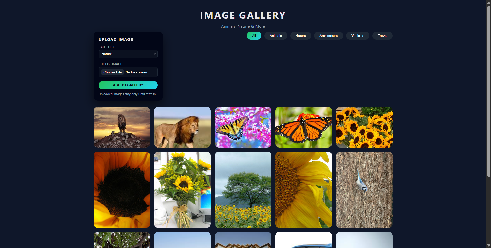
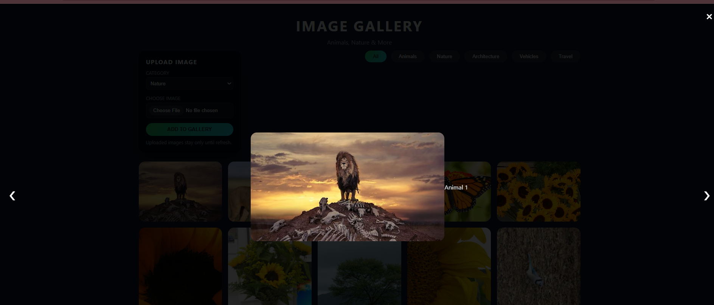

# 🖼️ Image Gallery — CodeAlpha Internship

  
  
  
  

  
  

---

## 🚀 Live Demo

  

---

## 📌 Project Overview

This Image Gallery was developed for the **CodeAlpha Frontend Development Internship — Task 1**.
It is a responsive, interactive gallery that includes category filters, hover animations, lightbox viewing, and an image upload feature.
The project fully satisfies all task requirements, along with polished UI enhancements for a modern user experience.

---

## 🎬 GIF Demo

  

---

## ✨ Features

### 🖼️ Responsive Image Grid

- Uses CSS Grid with auto-fit columns.
- Adjusts layout automatically on desktops, tablets, and mobiles.
- Ensures equal spacing, clean alignment, and smooth resizing.

### 🔍 Lightbox Image Viewer

- Click any image to open a fullscreen lightbox.
- Supports:
  - High-quality preview
  - Next/Previous navigation
  - ESC key to close
  - Arrow keys for navigation
  - Click-outside-to-close
- Displays dynamic captions from alt text.
- Smooth fade-in/out animations for premium interaction.

### ✨ Hover Animations

- Zoom-in effect on image hover.
- Brightness increase for image focus.
- A "View" overlay appears with subtle animation.
- Adds a modern, interactive feel to the gallery.

### 📤 Image Upload System

- Upload images directly from your device.
- Choose category before uploading.
- Added images instantly appear inside the gallery.
- Automatically clickable in the lightbox.
- Respects active category filter.
- Uploads stay until the page is refreshed (client-side memory only).

### 📱 Fully Mobile Responsive

- Layout rearranges based on device width.
- Button sizes adjust for touch screens.
- Lightbox scales beautifully on small screens.
- Smooth scrolling and interaction on mobile browsers.

### 🎨 Premium Dark UI Theme

- Deep navy background for a cinematic effect.
- Vibrant gradient buttons for contrast.
- Soft shadows, rounded edges, and clean typography.
- A polished, professional, modern interface.

---

## 🗂️ Category Filters

Your gallery supports multiple filter categories for targeted browsing:

### 🟢 All

Displays every image in the gallery.
Useful for browsing the complete collection.

### 🦁 Animals

Shows wildlife photos such as lions, birds, and other species.
All non-animal images are hidden instantly.

### 🌿 Nature

Contains flowers, landscapes, trees, butterflies, and natural scenery.
One of the largest categories in your gallery.

### 🏛️ Architecture

Displays structures like buildings, houses, and visually appealing architectural designs.

### 🚗 Vehicles

Shows cars, bikes, and transportation-related visuals.

### ✈️ Travel

Shows scenic travel-based images and outdoor landscapes.

### ⚙️ Filter Logic

- Every image includes a `data-category` property.
- Clicking a filter button hides all items not matching the selected category.
- The active filter button gets a dynamic gradient highlight.
- Uploaded images also respect the currently selected filter.
- Filtering is instant, smooth, and requires no page reload.

---

## 🖼️ Screenshots

### 📌 Gallery Screenshot

  

### 📌 Lightbox Screenshot

  

---

## 🚀 How to Run the Project

1. Download or clone the repository.
2. Ensure that the `images/` and `output/` folders remain in the correct structure.
3. Open **index.html** in any browser.
4. Interact with the filters, lightbox, and upload feature.

---

## 🛠️ Technologies Used

### ✔ HTML5

- Semantic layout
- Upload input fields
- Clean structural organization

### ✔ CSS3

- Responsive grid
- Hover animations
- Lightbox styling
- Gradient buttons
- Mobile optimizations

### ✔ JavaScript (ES6)

- Dynamic filtering
- DOM manipulation
- Lightbox viewer
- Image upload handling
- Keyboard navigation

---

## 👨‍💻 Developer

**Vemula Vamshi Krishna**
Frontend Developer — CodeAlpha Intern

---

## ✅ Status

✔ Completed — Successfully submitted for CodeAlpha Internship Task 1
